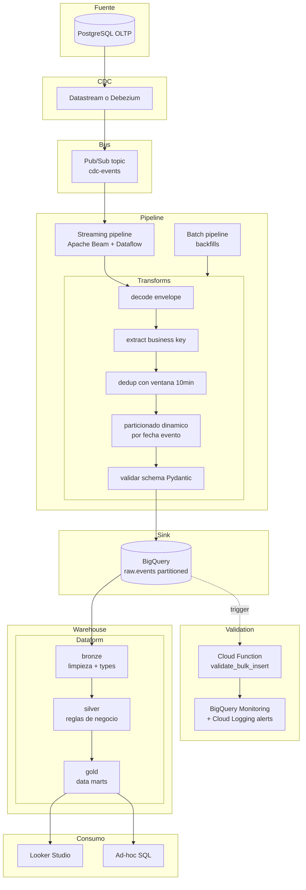

# gcp-etl-pipeline

Reference pipeline **PostgreSQL → BigQuery** sobre GCP con **Apache Beam + Dataflow +
Pub/Sub**, transformaciones idempotentes, particionado dinamico, validacion
post-load con Cloud Functions y modelado en Dataform (bronze/silver/gold).

> Codigo sintetico, sin datos ni clientes reales. Ilustra los patrones que uso en
> pipelines de datos productivos en GCP. Ver [`portfolio`](https://github.com/jpfiguer/portfolio)
> para case studies con contexto de negocio.

## Que muestra

- Pipeline **streaming** que consume CDC events desde Pub/Sub, deduplica con
  ventanas temporales, resuelve conflictos por clave de negocio y sinkea a
  BigQuery particionado
- Pipeline **batch** para backfills historicos con el mismo set de transforms
  compartidas — reutilizacion, no copia
- **Idempotencia** por clave de negocio + version timestamp — el mismo evento
  procesado N veces resulta en la misma fila final
- **Particionado dinamico** por fecha de evento (no por fecha de carga) para
  eficiencia de queries analiticas downstream
- **Validacion post-load** con una Cloud Function que corre counts + checksums
  contra la fuente
- **Modelado en Dataform** con arquitectura bronze/silver/gold + assertions
- **Terraform** para la infra completa (Pub/Sub topic, subscription, Dataflow
  service account, BigQuery datasets, Cloud Function)
- **Tests unitarios** con `apache_beam.testing` + fixtures sinteticas
- **CI/CD** con GitHub Actions: lint + type-check + tests + terraform plan en PR

## Stack

- Python 3.12 · Apache Beam (con `DataflowRunner` prod y `DirectRunner` local)
- Pub/Sub como canal de eventos CDC
- BigQuery como sink + storage analitico
- Dataform para transformacion (bronze → silver → gold)
- Cloud Functions para validacion post-load
- Terraform (con Google provider) para infra
- Pydantic v2 para schemas y validacion
- structlog para logging estructurado
- pytest para tests

## Arquitectura



## Estructura

```
gcp-etl-pipeline/
├── README.md
├── LICENSE                            MIT
├── pyproject.toml
├── .env.example
├── .gitignore
├── Dockerfile
├── docker-compose.yml
├── src/
│   ├── config.py                      settings via pydantic-settings
│   ├── logging_setup.py               structlog + json handler
│   ├── schemas.py                     modelos pydantic canonicos
│   └── pipeline/
│       ├── __init__.py
│       ├── streaming.py               beam pipeline consumiendo Pub/Sub
│       ├── batch.py                   beam pipeline para backfills
│       ├── transforms.py              DoFns reutilizables
│       └── validation.py              cloud function post-load
├── infra/
│   ├── terraform/                     Pub/Sub + BigQuery + Dataflow SA + CF
│   │   ├── main.tf
│   │   ├── variables.tf
│   │   └── outputs.tf
│   └── dataform/                      workspace bronze/silver/gold
│       ├── workflow_settings.yaml
│       └── definitions/
│           ├── sources/
│           ├── bronze/
│           ├── silver/
│           └── gold/
├── tests/
│   ├── test_transforms.py             unit tests con TestPipeline
│   └── test_schemas.py                validacion pydantic
└── .github/workflows/ci.yml
```

## Como correrlo localmente

```bash
cp .env.example .env
docker compose up -d          # levanta emulator de Pub/Sub + fake BigQuery
pip install -e ".[dev]"
python -m src.pipeline.streaming --runner DirectRunner --streaming
pytest
```

Para deploy a Dataflow:

```bash
python -m src.pipeline.streaming \
  --runner DataflowRunner \
  --project ${GCP_PROJECT} \
  --region ${GCP_REGION} \
  --staging_location gs://${BUCKET}/staging \
  --temp_location gs://${BUCKET}/temp \
  --streaming \
  --enable_streaming_engine
```

## Idempotencia — como

Cada evento CDC trae:

- `business_key` (natural key en la fuente, ej: order_id + version)
- `event_timestamp` (cuando ocurrio el cambio, no cuando llego al bus)
- `event_id` (uuid unico del evento, para exact-once en Pub/Sub)

El pipeline:

1. Descarta duplicados exactos por `event_id` con ventana de 10 min
2. Para conflictos por `business_key`, se queda con el `event_timestamp` mas
   reciente (last-write-wins)
3. Particiona por `DATE(event_timestamp)` en BigQuery — reprocesar una particion
   produce el mismo resultado

## Anti-patterns evitados

- ❌ **Escribir a BigQuery sin idempotencia**: reintentos duplican filas
- ❌ **Particionar por fecha de carga**: si reprocesas, ensucias la particion nueva
- ❌ **No validar post-load**: silencios entre CDC lag y BigQuery Monitoring
- ❌ **Dataform materializando todo**: se paga en storage y refresh, marca de mal criterio
- ❌ **Tests que corren contra GCP real**: costo + flakiness

## Licencia

MIT. Es codigo de referencia: esta pensado para leerse y adaptarse, no para
instalarse como dependencia. Usalo en lo que quieras.
